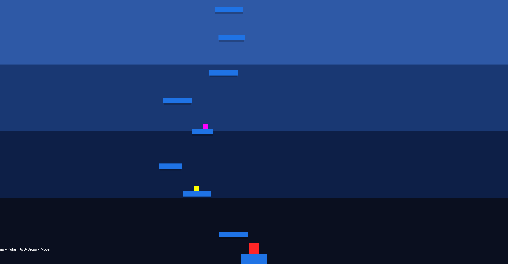

# Platform Game

Um jogo de plataforma 2D simples, divertido e com mecânicas modernas feito em **Python + Kivy**.

<p align="center">
  
  <br><br>
</p>

## 🎮 Sobre o Jogo

- Pule em plataformas que se movem, dão boost ou quebram após o uso
- Colete power-ups temporários: salto maior, velocidade extra, escudo e pontos bônus
- Dificuldade aumenta progressivamente com a altura alcançada
- Sistema de partículas para pulos e power-ups
- Sons de pulo, quebra de plataforma e música de fundo
- HUD moderna com painel superior, score destacado, recorde visível e power-ups coloridos
- Tela de Game Over estilizada com pontuação, recorde e botão de reinício
- Recorde salvo automaticamente em JSON

## Tecnologias utilizadas

- **Python** 3.8+
- **Kivy** 2.3+ (framework multiplataforma para interfaces gráficas)
- **kivy-deps** (dependências para Windows: glew, sdl2, angle)

## Requisitos

### Dependências principais

```bash
pip install kivy==2.3.1
```

### Windows (recomendado instalar também)
```Bash
pip install kivy_deps.glew kivy_deps.sdl2 kivy_deps.angle
```
### Como executar

1 - Clone o repositório (ou baixe o ZIP):

```Bash
git clone https://github.com/SEU-USUARIO/platform-game.git
cd platform-game
```

2 - (Recomendado) Crie e ative um ambiente virtual:

```Bash
# Windows
python -m venv env
env\Scripts\activate

# Linux / macOS
python3 -m venv env
source env/bin/activate
```

3 - Instale as dependências:

```Bash
pip install -r requirements.txt
```

4 - Coloque os arquivos de áudio na pasta correta:

```text
assets/audio/
├── bg_music.mp3
├── sfx_jump.wav     (ou .mp3)
└── sfx_break.wav    (ou .mp3)
```

5 - Execute o jogo:

```Bash
python main.py
```

### Controles

- W ou Seta para cima → Pular
- A / D ou Setas esquerda/direita → Mover
- R → Reiniciar após Game Over (opcional)

Estrutura do projeto
```text
platform-game/
├── main.py                 # Ponto de entrada da aplicação
├── .gitignore
├── README.md
├── requirements.txt
├── assets/
│   └── audio/              # Arquivos de som e música
├── data/
│   └── high_score.json     # Arquivo de recorde (gerado automaticamente)
└── src/
    ├── __init__.py
    ├── constants.py        # Constantes do jogo
    ├── utils/
    │   ├── __init__.py
    │   ├── audio.py        # Gerenciador de sons
    │   └── highscore.py    # Gerenciador de recorde
    └── game/
        ├── __init__.py
        ├── core.py         # Lógica principal do jogo
        ├── player.py
        ├── platform.py
        ├── powerup.py
        ├── particle.py
        └── effects.py      # Lógica de power-ups e timers
```
### Como contribuir
Contribuições são muito bem-vindas!
Algumas ideias:

- Adicionar menu inicial
- Implementar tela de pausa
- Mais tipos de power-ups
- Suporte a controles por toque (mobile)
- Mais efeitos sonoros e partículas
- Suporte a gamepad
- Tradução para outros idiomas


1. Faça um fork do repositório
2. Crie uma branch para sua feature (git checkout -b feature/nova-coisa)
3. Commit suas mudanças (git commit -m 'Adiciona nova feature')
4. Push para a branch (git push origin feature/nova-coisa)
5. Abra um Pull Request

### Licença
MIT License
Sinta-se à vontade para usar, modificar e distribuir, mantendo os créditos.

Feito Python e Kivy
Qualquer dúvida ou sugestão, é só abrir uma issue